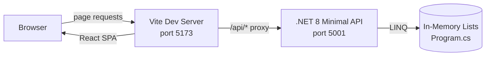
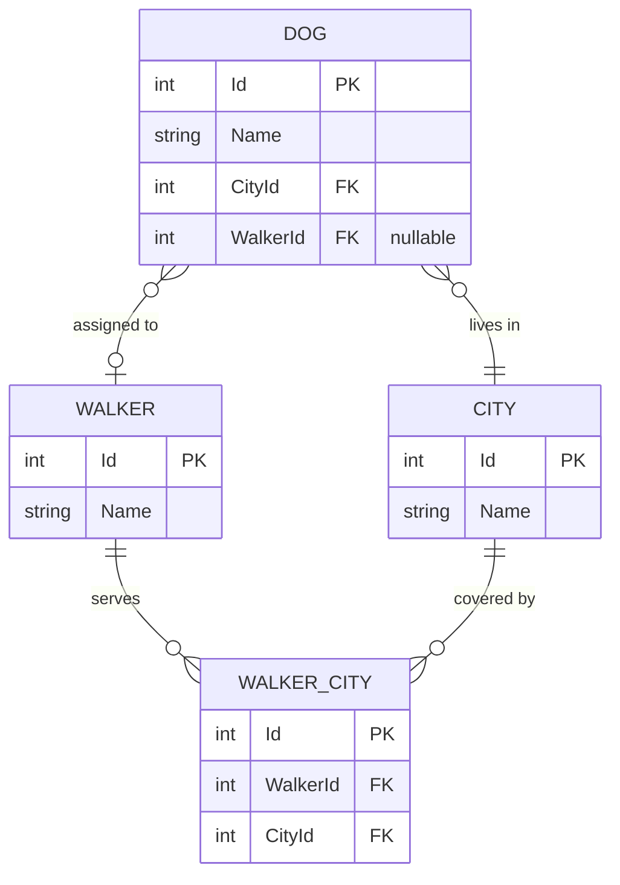

<!-- Last updated: 2026-05-21 -->
<!-- Last change: Initial architecture document -->

# DeShawn's Dog Walking - Technical Architecture

## System Overview

A full-stack web application with a React SPA served by a Vite dev server and a .NET 8 Minimal API backend. All data is stored in-memory as C# `List<T>` collections inside `Program.cs`. A Vite proxy routes every `/api/*` request from the browser to the .NET server, so the React app never has to know about CORS or hard-coded ports.



## Component Breakdown

### Frontend (client/src/)

| File | Responsibility |
|---|---|
| `index.jsx` | App entry point; sets up `BrowserRouter` and all `<Route>` definitions |
| `App.jsx` | Root layout; renders the `<Navbar>` (with nav links) and `<Outlet>` |
| `Home.jsx` | Dog list view; handles view-all-dogs and delete-dog (US1, US8) |
| `DogDetails.jsx` | Dog detail view; shows name, city, current walker (US2) |
| `AddDogForm.jsx` | Add-dog form; city dropdown + submit (US3) |
| `WalkerList.jsx` | Walker list; city filter dropdown, assign-dog button, delete button (US4, US9) |
| `WalkerForm.jsx` | Walker edit form; city checkboxes + update submit (US7) |
| `EligibleDogs.jsx` | Eligible-dogs list for a specific walker; click to assign (US5) |
| `CityList.jsx` | City list + add-city input (US6) |

### Backend (Program.cs)

All logic lives in a single `Program.cs` using .NET 8 Minimal API. Endpoint handlers use LINQ to query and mutate the in-memory collections declared at the top of the file.

### In-Memory Data Store

Four `List<T>` collections at the top of `Program.cs` act as the database. They are pre-seeded with sample data at startup and reset whenever the server restarts.

## Data Model

```
List<Dog>        Id (int), Name (string), CityId (int), WalkerId (int?)
List<Walker>     Id (int), Name (string)
List<City>       Id (int), Name (string)
List<WalkerCity> Id (int), WalkerId (int), CityId (int)
```

Key rules:
- A dog belongs to exactly one city and has zero or one walker.
- A walker serves one or more cities via `WalkerCity` (many-to-many).
- Deleting a walker must set `WalkerId = null` on every dog that walker was assigned to.



## API Design

All routes are prefixed with `/api` to match the Vite proxy rule.

### Dogs

| Method | Route | Description | Status |
|---|---|---|---|
| GET | `/api/dogs` | All dogs, each including city name and walker name | 200 |
| GET | `/api/dogs/{id}` | Single dog with city and walker details | 200 / 404 |
| POST | `/api/dogs` | Create a dog; body: `{ Name, CityId, WalkerId? }` | 201 |
| PUT | `/api/dogs/{id}` | Assign a walker; body: `{ WalkerId }` | 200 |
| DELETE | `/api/dogs/{id}` | Delete a dog | 204 |

### Walkers

| Method | Route | Description | Status |
|---|---|---|---|
| GET | `/api/walkers` | All walkers with their cities; optional `?cityId=` query param | 200 |
| GET | `/api/walkers/{id}` | Single walker with cities | 200 / 404 |
| GET | `/api/walkers/{id}/dogs` | Eligible dogs: in walker's cities, not already assigned to this walker | 200 |
| PUT | `/api/walkers/{id}` | Replace walker's city list; body: `{ CityIds: [int] }` | 204 |
| DELETE | `/api/walkers/{id}` | Delete walker; nulls out `WalkerId` on assigned dogs | 204 |

### Cities

| Method | Route | Description | Status |
|---|---|---|---|
| GET | `/api/cities` | All cities | 200 |
| POST | `/api/cities` | Create a city; body: `{ Name }` | 201 |

### Notes

- `GET /api/dogs/{id}` and `GET /api/walkers/{id}` return 404 when the record does not exist.
- `PUT /api/walkers/{id}` receives the complete new city list each time; the handler deletes all existing `WalkerCity` records for that walker and inserts fresh ones.
- `GET /api/walkers/{id}/dogs` filters with two LINQ conditions: dog's `CityId` is in the walker's cities, AND dog's `WalkerId` is not equal to the walker's id.

## Infrastructure and Deployment

This project runs in development only (no production deployment in scope for the assignment).

| Concern | Tool |
|---|---|
| API server | .NET 8, launched via VS Code debugger (`F5`); listens on `https://localhost:5001` |
| Frontend server | Vite, started with `npm run dev` inside the `client/` folder |
| API docs | Swagger UI auto-opens at `https://localhost:5001/swagger` via `.vscode/launch.json` |
| Proxy config | `client/vite.config.js` forwards `/api/*` to `https://localhost:5001` |

## Project Conventions

### Development Workflow

Build feature by feature: complete one full user story (API endpoint + React component) before starting the next. This is the approach the course recommends and what each step in the roadmap reflects.

### Branch Naming

`feature/{issue-number}/{short-description}` (example: `feature/1/view-all-dogs`)

### Response Shape Convention

When an endpoint returns a dog or walker, include related names inline (example: a dog response includes `walkerName` and `cityName`, not just the foreign key IDs). This avoids extra round-trips from the React side.

### HTTP Status Codes

| Situation | Code |
|---|---|
| Successful read | 200 |
| Successful create | 201 |
| Successful delete or update with no body | 204 |
| Record not found | 404 |
